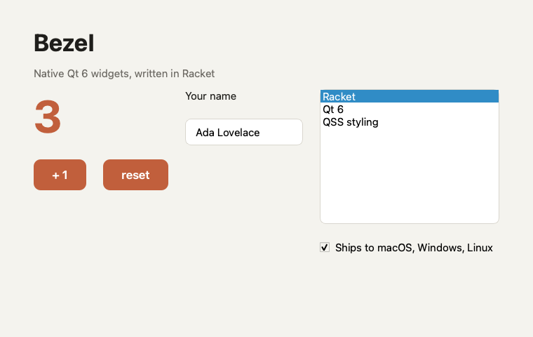

# Bezel

Native [Qt 6](https://www.qt.io/) GUIs for [Racket](https://racket-lang.org/). Write your application in Racket and ship real Qt Widgets on Windows, macOS, and Linux.

[](https://github.com/turinglambdaai/bezel/actions/workflows/ci.yml)   [](LICENSE) [](CHANGELOG.md)

**English** · [中文](README.zh-CN.md)

## Why Bezel?

Racket's `racket/gui` is useful but difficult to style into a modern product UI. Web-based shells give you CSS but trade away native widgets. Bezel takes a third path: a stable C ABI over Qt Widgets, with a Racket layer that handles GUI-thread marshaling, signals, lifetime rules, diagnostics, and generated bindings.

You get:

- **Real Qt widgets** — windows, buttons, inputs, lists, sliders, menus, dialogs, layouts, plus generator-backed expansion.
- **QSS styling** — Qt's CSS-like styling system.
- **Thread-safe public API semantics** — public widget calls can originate from any Racket thread and marshal to the GUI thread.
- **Agent-friendly verification** — `widget-grab-png` renders real widgets to PNG; CI runs headlessly with Qt's offscreen backend.
- **Checked native boundary** — the Racket layer validates the shim ABI before exposing the API.
- **Portable release packages** — supported release targets embed `libbezel`, Qt runtime libraries, required Qt plugins, and mandatory license/relinking material inside the Racket package; end users do not need a Qt SDK, CMake, or a C++ compiler.
- **Release diagnostics** — `raco bezel doctor` reports platform, architecture, runtime candidates, environment overrides, and ABI load status.
- **Fail-closed public redistribution** — public binaries are pinned to QtBase 6.8.3, LGPLv3 dynamic linking, verified corresponding source, and machine-enforced package/license boundaries.

<p align="center"></p>

## Hello Bezel

```racket
#lang racket/base
(require bezel)

(make-application #:name "Hello Bezel")

(define n (box 0))
(define count (make-label "Clicked 0 times"))
(define btn (make-button "Click me"))

(connect! btn "clicked()"
          (lambda _
            (set-box! n (add1 (unbox n)))
            (widget-set-text! count
                              (format "Clicked ~a times" (unbox n)))))

(define win (make-window #:title "Hello Bezel" #:size '(320 140)))
(layout! win (vbox count btn))
(run win)
```

## Install a release package

For normal application development you only need **Racket 8.0+** on a supported release target. Download the matching `bezel-lib-<platform>.zip` from the GitHub Release and install it as package `bezel-lib`:

```text
raco pkg install --auto --name bezel-lib /path/to/bezel-lib-<platform>.zip
raco bezel doctor
```

Current prebuilt targets:

| Target | Release package | Qt SDK/CMake/compiler needed by user? |
| --- | --- | --- |
| Linux x86_64 | `bezel-lib-linux-x86_64.zip` | No |
| Windows x86_64 | `bezel-lib-windows-x86_64.zip` | No |
| macOS Apple Silicon | `bezel-lib-macosx-aarch64.zip` | No |

Every release package is assembled from a platform runtime bundle and then tested on a **fresh runner that installs Racket only**. That runner installs the zip through `raco pkg install`, runs `raco bezel doctor`, constructs real Qt widgets, pumps the event loop, and tears the application down. CI does not set `BEZEL_NATIVE_DIR` for this test, so the package-local runtime path is exercised exactly as an end user sees it.

The Release also contains raw `bezel-native-*` runtime archives for embedding into other package/application workflows, Racket-compatible `.CHECKSUM` files, a `SHA256SUMS` manifest, a Qt redistribution record, and the **exact SHA-256-verified QtBase source archive** corresponding to the public runtime policy. Every native runtime contains a `LICENSES/` tree with the Bezel MIT license, Qt license texts, third-party attributions/notices, compliance metadata, and relinking instructions.

## Develop Bezel from source

Contributors and unsupported platforms still build the shim from source. This path requires Qt 6, CMake, and a C++17 compiler:

```bash
git clone https://github.com/turinglambdaai/bezel.git
cd bezel
cmake -S bezel-shim -B bezel-shim/build -DCMAKE_BUILD_TYPE=Release
cmake --build bezel-shim/build
raco pkg install --auto --no-docs --link ./bezel-lib
raco pkg install --auto --no-docs --link ./bezel-test
raco pkg install --auto --no-docs --link ./bezel
QT_QPA_PLATFORM=offscreen raco test bezel-test/
```

If a development build lives elsewhere, point `BEZEL_LIBRARY` at the shared library. For a manually extracted release runtime, point `BEZEL_NATIVE_DIR` at the runtime root.

## Architecture

Bezel deliberately keeps the native boundary small:

1. **C++ shim / stable C ABI** — Racket's FFI talks to flat C functions while Qt remains C++ behind validated opaque handles.
2. **Cooperative GUI-thread marshaling** — Qt calls are performed on the GUI thread without a blocking C-side cross-thread handoff that could freeze Racket CS scheduling.
3. **Signal bridge** — Qt signal → C++ sink → synchronized queue → Racket dispatcher → user handler. Widget calls made by handlers marshal back to the GUI thread.
4. **Lifetime registry** — Qt parent ownership plus live-handle validation. Parentless objects remain alive until explicit deletion or application teardown; Bezel intentionally avoids deleting GC finalizers.
5. **Generated bindings** — JSON specs generate both C++ and Racket code. Generated public wrappers use the same liveness checks, error propagation, and GUI marshaling rules as handwritten APIs.

See [docs/architecture.md](docs/architecture.md) for the deeper design.

## Platform status

| Capability | macOS | Windows | Linux |
| --- | --- | --- | --- |
| Application / cooperative run loop | ✅ | ✅ | ✅ |
| Core widgets + layouts | ✅ | ✅ | ✅ |
| Menus + actions | ✅ | ✅ | ✅ |
| Typed signals (`bool`, `int`, `double`, `QString`) | ✅ | ✅ | ✅ |
| Cross-thread public widget access | ✅ | ✅ | ✅ |
| Generated-binding marshaling | ✅ | ✅ | ✅ |
| QSS styling | ✅ | ✅ | ✅ |
| `widget-grab-png` | ✅ | ✅ | ✅ |
| Headless real-object CI | ✅ | ✅ | ✅ |
| Self-contained release package | Apple Silicon | x86_64 | x86_64 |

Unsupported Qt signal parameter types currently fall back to delivery without converted arguments. The widget surface is intentionally a focused core set today; the generator is the expansion path rather than a claim of complete Qt coverage.

## API tour

### Application lifecycle

```racket
(make-application #:name "My App")
(run win)
(quit! 0)
```

`make-application` is idempotent and must happen before widgets are created. `run` is a cooperative pump rather than a blocking `exec`; closing the last visible window stops it by default.

### Widgets and layouts

```racket
(define win (make-window #:title "Team" #:size '(420 240) #:stylesheet qss))
(define name (make-line-edit))
(set-placeholder! name "Ada Lovelace")
(define experience (make-slider))
(set-widget-range! experience 0 15)

(layout! win
         (vbox #:margins '(20 20 20 20)
               (form (list "Name:" name)
                     (list "Experience:" experience))
               (hbox stretch (make-button "Submit"))))
```

Tree-style composition (`vbox`, `hbox`, `grid`, `form`, `stretch`) and imperative layout builders are both available.

### Signals

```racket
(define conn-id
  (connect! btn "clicked()" (lambda _ (displayln "clicked!"))))
(connect! slider "valueChanged(int)" (lambda (v) (displayln v)))
(connect! edit "textChanged(QString)" (lambda (s) (displayln s)))
(disconnect! btn conn-id)
```

Handlers run on Bezel's dispatcher thread. Public widget calls made by handlers marshal back to the GUI thread. Explicit disconnect, target destruction, and application cleanup retire both native connection records and Racket handlers.

### Verification

```racket
(define png (widget-grab-png win))
(process-events! 50)
(emit-test-signal! btn "clicked()")
```

The repository showcase image is generated by `scripts/showcase.rkt` from a real headless Qt render.

### Object lifetime

```racket
(bezel-alive? widget)
(bezel-delete! widget)
(qt-object-name widget)
(set-qt-object-name! widget "x")
(object-set-parent! widget parent)
```

Ownership follows Qt parent rules. Bezel does not perform GC-driven deletes, avoiding late-finalizer races against recycled native addresses.

## Native runtime resolution

The loader searches in this order:

1. `BEZEL_LIBRARY` — explicit shared-library file.
2. `BEZEL_NATIVE_DIR` — explicit extracted runtime root.
3. package-local `bezel-lib/native/<os>-<arch>/` — normal self-contained release package path.
4. `bezel-shim/build` — source-checkout convenience.
5. normal operating-system library lookup.

When a bundled Qt plugin directory is present and the application has not set `QT_PLUGIN_PATH`, Bezel configures the package-local plugin path before `QApplication` is constructed.

Run `raco bezel doctor` whenever native loading fails.

## Release engineering

A `v*` tag triggers the Release workflow. Publishing is gated on:

- consistent versions in `bezel-lib`, the umbrella package, CMake shim, changelog, and tag;
- reproducible generated bindings;
- the machine-readable Qt redistribution policy and exact QtBase 6.8.3 source hash;
- generated Qt/LGPL/third-party license and attribution material;
- dynamic Qt linkage and platform package dependency boundaries;
- three-platform native builds;
- portable runtime packaging;
- fresh-runner self-contained package installation and real-widget smoke tests;
- publication of the exact verified QtBase source beside public binaries;
- release SHA-256 generation.

On Linux, the public runtime's QtBase is built from that exact source archive on Ubuntu 22.04 as shared libraries with ICU disabled and QtBase's bundled third-party copies selected where supported. This avoids the unrelated ICU 73 dependency of the public online binary while making the Linux binary/source relationship especially explicit.

See [docs/COMMERCIAL_RELEASE.md](docs/COMMERCIAL_RELEASE.md) and [docs/LGPL_RELINKING.md](docs/LGPL_RELINKING.md) for the complete release and replacement/relinking contract.

## Qt licensing model

Bezel itself is MIT licensed. **Bezel's public prebuilt GitHub runtime path is intentionally Qt LGPLv3-only and dynamically linked.** It ships required notices/relinking material and publishes the exact verified QtBase source archive with the release. The public workflow refuses a release that is merely labelled "commercial Qt" while being built from public Qt artifacts.

A proprietary product may instead use a commercial Qt license. That should be built through a separate private pipeline backed by the license holder's actual commercial Qt distribution and entitlements; do not treat the public Bezel workflow as proof of commercial-license provenance.

If you redistribute Bezel's public Qt binaries inside your own product, you become a redistributor too. Preserve the applicable notices/source availability and recipient rights, and evaluate your final installer, signing/DRM model, application store, device restrictions, contracts, and application-specific dependencies. The repository's automation is a strong engineering control and audit trail, not a substitute for product-specific legal review.

## Repository structure

```text
bezel/
├── bezel/            # umbrella package
├── bezel-lib/        # Racket collection `bezel`
├── bezel-shim/       # C++ shim / C ABI
├── bezel-doc/        # Scribble documentation
├── bezel-test/       # real-object headless tests
├── examples/         # hello / counter / form
├── scripts/          # packaging, smoke, showcase, release checks
├── tools/generator/  # JSON specs -> C++ + Racket bindings
├── release/          # machine-readable redistribution policy
└── docs/             # architecture, licensing, and commercial release guides
```

## Roadmap

- [x] **Phase 1** — C++ shim, C ABI, widgets, layouts, menus, dialogs.
- [x] **Phase 2** — typed signal bridge, cooperative threading, lifetime registry, generator.
- [x] **Phase 3** — three-platform real-object CI, PNG verification, showcase.
- [x] **Phase 3.5** — ABI guard, lifecycle hardening, generated-binding safety, reproducibility.
- [x] **Phase 4** — relocatable native runtimes, self-contained Racket package archives, clean-machine install smoke tests, gated GitHub Releases.
- [x] **Phase 4.1** — fail-closed LGPL public redistribution, exact-source publication, embedded notices/relinking material, dependency-boundary enforcement.
- [ ] **Phase 5** — broader Qt class coverage, higher-level API ergonomics, final-application packaging/signing helpers.

## License

Bezel is licensed under the [MIT License](LICENSE). Redistributed Qt components and their third-party components keep their own applicable license terms; public binary packages include the corresponding licensing material under `LICENSES/`.
